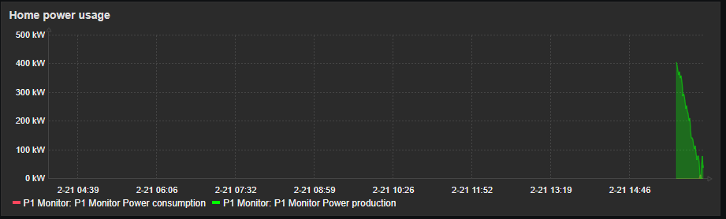

# P1 Monitoring

This is a template and script for monitoring your power consumption and production with a P1 Monitor installation.

For more information about the required software
- [P1 Monitor](https://www.ztatz.nl/)
- [Zabbix](https://www.zabbix.com/)

## Installation

- copy p1mon.sh to /usr/bin/zabbix/externalscripts on your Zabbix server or proxy.
- uncomment the "ExternalScripts=/usr/lib/zabbix/externalscripts" parameter in the Zabbix server (or proxy) configuration and reload the daemon.
- load the template into Zabbix
- add the raspberry pi to zabbix, configure it for type "agent" and make sure you set the correct IP.

done, you can add a graph to your dashboard if you like. :-)

## Todo
- add gas consumption
- add water consumption
