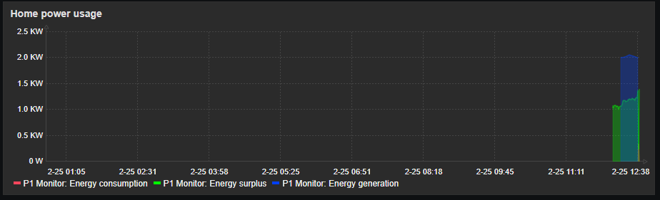
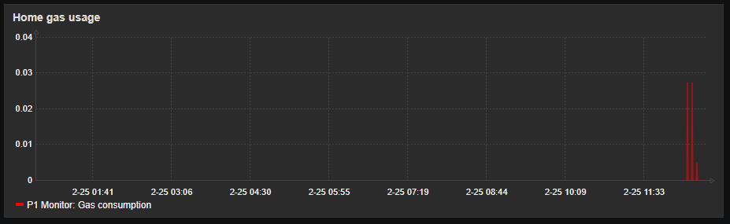

# P1 Monitoring

This is a template and script for monitoring your energy and gas usage and production.
It requires at least a P1 Monitor setup. Extra functionality can be achieved when using a SolarEdge solarpanel setup.

For more information about the required software
- [P1 Monitor](https://www.ztatz.nl/)
- [Zabbix](https://www.zabbix.com/)
- [SolarEdge](https://www.solaredge.com/)

## Installation

- copy p1mon.sh to /usr/bin/zabbix/externalscripts on your Zabbix server or proxy.
- uncomment the "ExternalScripts=/usr/lib/zabbix/externalscripts" parameter in the Zabbix server (or proxy) configuration and reload the daemon.
- load the template into Zabbix
- add the raspberry pi to zabbix, configure it for type "agent" and make sure you set the correct IP
- Add the macro {$SOLAR_ID} and set it to your SolarEdge Site ID
- Add the macro {$SOLAR_KEY} and set it to your SolarEdge API key

done, you can add a graph to your dashboard if you like. :-)

## FAQ

- Where do i get the SolarEdge site ID?

Log in to the SolarEdge cloud site, it's on the top right.

- Where do i get a SolarEdge API key?

Check out the SolarEdge documentation for their cloud service. It's in there.
If you rented the installation and don't have access to the entire site, ask your service partner to supply you with the key.

- The watermeter function isn't working, how come?

i don't have a watermeter (yet!) so i couldn't test the functionality.
If it doesn't work please send me the API out you're recieving.

- Can you add some feature/function?

First off, feel free to create your own version which you can shape to your own needs.
I am willing to try and add functionality, but my equipment is limited, so i might need access or (at least) output information.
